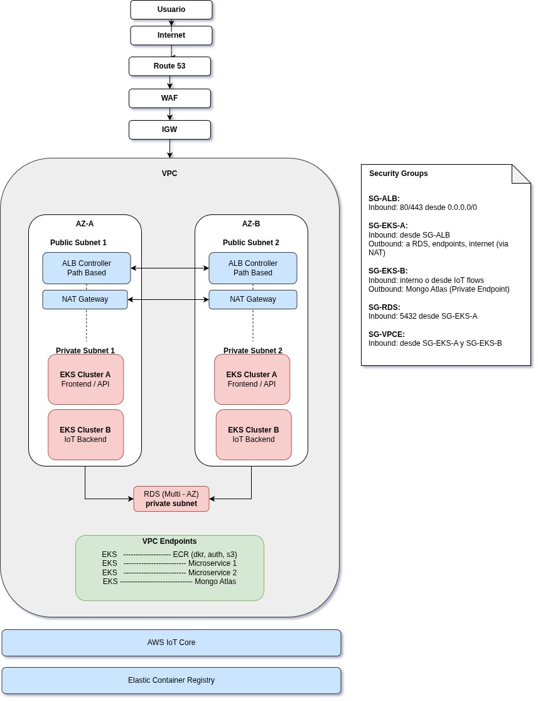
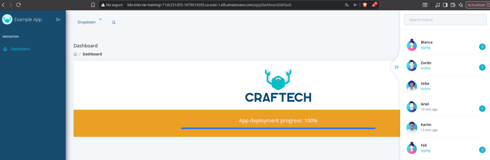
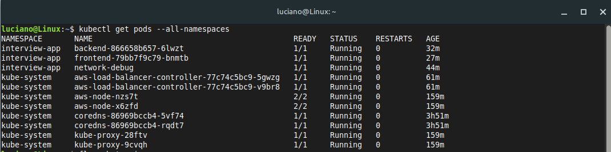
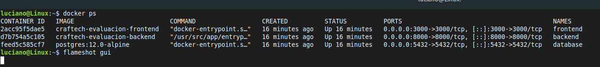
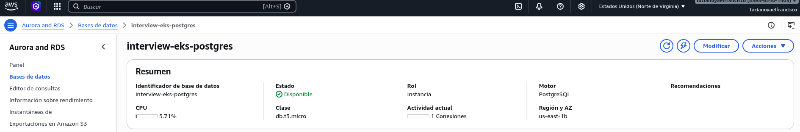
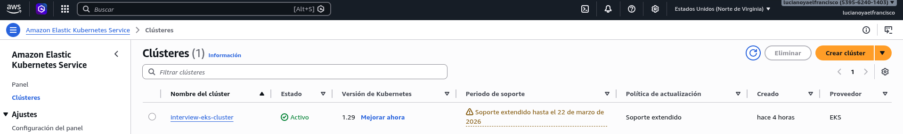

# Interview Resolution - Setup Completo

**Author**: Luciano Yael Francisco

## Descripción

Este proyecto contiene las tres pruebas técnicas solicitadas por craftech.

## Índice

- [Prueba 1: Diagrama de Red](#prueba-1-diagrama-de-red)
- [Prueba 2: Despliegue de Aplicación](#prueba-2-despliegue-de-aplicación)
- [Prueba 3: CI/CD Pipeline](#prueba-3-cicd-pipeline)
- [Capturas de Pantalla](#capturas-de-pantalla)

---

# Prueba 1: Diagrama de Red
# Arquitectura Cloud-Native en AWS


La arquitectura está pensada como una solución cloud-native en AWS que separa dos flujos principales: el tráfico web de usuarios y el procesamiento de datos IoT, manteniendo ambos desacoplados pero dentro de una misma VPC para simplificar la conectividad interna.

El ingreso de tráfico se resuelve mediante Route 53, que apunta a un ALB desplegado en subnets públicas con multi-AZ. Sobre ese ALB se asocia AWS WAF. A partir de ahí, el tráfico se enruta mediante reglas de Ingress (URL PATH) hacia un primer cluster de EKS que corre en subnets privadas, sin exposición directa a internet.

Este cluster EKS principal maneja la lógica de negocio y frontend, se conecta a una base de datos relacional en Amazon RDS, también ubicada en subnets privadas y configurada en modo Multi-AZ. Toda la comunicación se controla mediante Security Groups, permitiendo únicamente el tráfico necesario entre componentes.

En paralelo, se define un segundo cluster EKS dedicado exclusivamente al procesamiento de eventos IoT. Los dispositivos se conectan a AWS IoT Core, que funciona como broker MQTT administrado fuera de la VPC. Desde allí, los eventos son consumidos por este segundo cluster, que los procesa y persiste en MongoDB Atlas utilizando PrivateLink.

Se utilizan VPC Endpoints para integraciones internas, como el acceso a ECR y a ambos microservicios externos. Si los microservicios no soportasen privateLink, se incorporan NAT Gateways en las subnets públicas, uno por cada AZ, permitiendo a los recursos en subnets privadas iniciar conexiones salientes.


# Prueba 2: Despliegue de Aplicación

URL: http://k8s-intervie-mainingr-71dc251d35-1079019205.us-east-1.elb.amazonaws.com/auth/signin

Aplicación **full-stack** con:
- **Frontend**: React.js
- **Backend**: Django REST
- **Base de datos**: PostgreSQL

Desplegable localmente con Docker Compose y en AWS con Terraform + Kubernetes.

## Instalaciones Previas
: Acceso seguro a servicios AWS sin internet público
### Instalar Terraform
```bash
# Descargar desde: https://www.terraform.io/downloads
terraform version
```

### Instalar kubectl
```bash
# Descargar desde: https://kubernetes.io/docs/tasks/tools/
kubectl version --client
```

### Instalar AWS CLI
```bash
sudo apt-get install -y pipx && pipx install awscli
aws --version
```

## Configuración AWS

### 1. Crear Access Key

Ve a [AWS Console](https://console.aws.amazon.com/) → Avatar → Credenciales de Seguridad → Nueva clave de acceso

### 2. Configurar AWS CLI

```bash
aws configure
```

Ingresa:
- AWS Access Key ID
- AWS Secret Access Key
- Region: `us-east-1`
- Output: `json`

## Despliegue en AWS

### 3. Levantar Infraestructura con Terraform

```bash
cd terraform
terraform init
terraform plan
terraform apply
```

### 4. Logearse a ECR

```bash
aws ecr get-login-password --region us-east-1 | docker login --username AWS --password-stdin <ECR_URI>
```

### 5. Conectar kubectl a EKS

```bash
aws eks update-kubeconfig --region us-east-1 --name <EKS_CLUSTER_NAME>
kubectl get nodes
```

### 6. Instalar ALB Controller

```bash
bash ./architecture/install-alb-controller.sh
kubectl get deployment -n kube-system | grep aws-load-balancer-controller
```

### 7. Buildear y Pushear Imágenes

**Backend:**
```bash
cd backend
docker build -t <ECR_URI>/backend:latest .
docker push <ECR_URI>/backend:latest
cd ..
```

**Frontend:**
```bash
cd frontend
docker build -t <ECR_URI>/frontend:latest .
docker push <ECR_URI>/frontend:latest
cd ..
```

### 8. Desplegar en Kubernetes

```bash
kubectl apply -f architecture/kubernetes
kubectl get pods -n interview
```

## Despliegue Local

Para desplegar la arquitectura completa localmente:

```bash
docker compose up -d
```

## Consideraciones Importantes

### URLs y CORS
Se eliminaron URLs hardcoded para evitar problemas de CORS en AWS.

### Load Balancer y Ingress
ALB configurado con reglas de ingreso para enrutar tráfico entre frontend y backend.

### TLS/HTTPS
Por simplicidad no está incluido. Para producción, usar **Cert-Manager + Let's Encrypt**.


# Prueba 3: CI/CD Pipeline

## Pipeline Nginx con GitHub Actions

Automatización completa de **Build → Push → Deploy** mediante GitHub Actions.

### Flujo Automático

1. Editas `nginx-cicd/index.html`
2. Haces `git push`
3. GitHub Actions se ejecuta automáticamente
4. Buildea la imagen Docker
5. Pushea a Docker Hub

### Configuración

**Agregar Secrets en GitHub:** Settings → Secrets and variables → Actions

- `DOCKERHUB_USERNAME`: Tu usuario de Docker Hub
- `DOCKERHUB_PASSWORD`: Tu token de Docker Hub

### Desplegar Localmente

```bash
cd nginx-cicd && docker compose pull && docker compose up -d
```

Accede a: `http://localhost:8080`


### Tecnologías

- GitHub Actions
- Docker / Docker Hub
- Nginx
- ECR / EKS (opcionales)

---

## Capturas de Pantalla

### Frontend - Dashboard


### Kubernetes - Pods


### Docker Compose Local


### AWS RDS


### EKS Cluster

